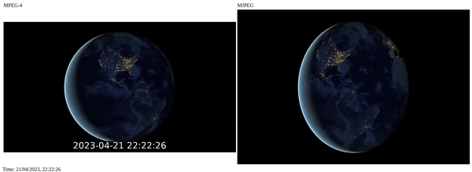
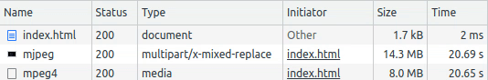

Fragmented MP4 Live Streaming Solution
======================================

* * *

FastAPI + ffmpeg as a solution for natively supported live streaming in browsers. Made for [my Medium article](https://medium.com/@vlad.pbr/in-browser-live-video-using-fragmented-mp4-3aedb600a07e).

# Overview

This repository showcases how fragmented MP4, format which is natively supported by the `<video>` tag, can be used to stream live video footage and how it compares to another example solution, Motion JPEG. The associated article delves deeper into the world of browser live streaming:

- Existing live streaming solutions and how fragmented MP4 streaming overcomes their main shortcoming - latency
- Bandwidth and control as main advantages of fragmented MP4 over MJPEG
- Optimizing client side code in order to keep up with the live edge
- Overcoming the constant framerate limitation of MP4

    
    

